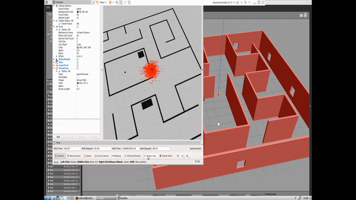

# Udacity RoboND Project P3 - Where Am I
Ros Kinematic "Monte Carlo Localization" Project  (Where Am I) Solution for Udacity Robotics Software Engineer Nanodegree Program




# Project Overview

Welcome to the  `Where Am I?`  localization project! In this project, We will learn to utilize ROS AMCL package to accurately localize a mobile robot inside a map in the Gazebo simulation environments.


-   Create a ROS package that launches a custom robot model in a custom Gazebo world
    
-   Utilize the ROS AMCL package and the Tele-Operation / Navigation Stack to localize the robot
    
-   Explore, add, and tune specific parameters corresponding to each package to achieve the best possible localization results


### Native Installation & Virtual Machine

If you are working with a native ROS installation or using a VM, some of the following package might need to be installed. You could install them as shown below:

```
$ sudo apt-get install ros-kinetic-navigation
$ sudo apt-get install ros-kinetic-map-server
$ sudo apt-get install ros-kinetic-move-base
$ sudo apt-get install ros-kinetic-amcl

```
###  PGM Map Creator

##### Install Dependencies

We need  `libignition-math2-dev`  and  `protobuf-compiler`  to compile the map creator:

```
sudo apt-get install libignition-math2-dev protobuf-compiler
```

# Project  Directory Structure
```
        .[RoboND-Where-Am-I-Project-P3]            # Where Am I Project
	├── my_robot                               # my_robot package        
	│   │   ├── config                         # config folder for configuration files   
	│   │   │   ├── base_local_planner_params.yaml
	│   │   │   ├── costmap_common_params.yaml
	│   │   │   ├── global_costmap_params.yaml
	│   │   │   ├── local_costmap_params.yaml
	│   │   ├── launch                         # launch folder for launch files   
	│   │   │   ├── amcl.launch
	│   │   │   ├── robot_description.launch
	│   │   │   ├── world.launch
	│   │   ├── maps                           	   # maps folder for maps
	│   │   │   ├── map.pgm
	│   │   │   ├── map.yaml
	│   │   ├── meshes                         # meshes folder for sensors
	│   │   │   ├── hokuyo.dae
	│   │   ├── rviz                           # rviz folder for rviz configuration files
	│   │   │   ├── default.rviz
	│   │   ├── urdf                           # urdf folder for xarco files
	│   │   │   ├── my_robot.gazebo
	│   │   │   ├── my_robot.xacro
	│   │   ├── worlds                         # world folder for world files
	│   │   │   ├── empty.world
	│   │   │   ├── myworld.world
	│   │   ├── CMakeLists.txt                 # compiler instructions
	│   │   ├── package.xml                    # package info
	│   ├── pgm_map_creator                    # pgm_map_creator        
	│   │   ├── launch                         # launch folder for launch files   
	│   │   │   ├── request_publisher.launch
	│   │   ├── maps                           # maps folder for generated maps
	│   │   │   ├── Backup_map.pgm
	│   │   │   ├── map.pgm
	│   │   ├── msgs                           # msgs folder for communication files
	│   │   │   ├── CMakeLists.txt
	│   │   │   ├── collision_map_request.proto
	│   │   ├── src                            # src folder for main function
	│   │   │   ├── collision_map_creator.cc
	│   │   │   ├── request_publisher.cc
	│   │   ├── world                          # world folder for world files
	│   │   │   ├── myoffice.world
	│   │   │   ├── udacity_mtv
	│   │   ├── CMakeLists.txt                 # compiler instructions
	│   │   ├── LICENSE                        # License for repository
	│   │   ├── README.md                      # README for documentation
	│   │   ├── package.xml                    # package info
	│   ├── teleop_twist_keyboard              # teleop_twist_keyboard
	│   │   ├── CHANGELOG.rst                  # change log
	│   │   ├── CMakeLists.txt                 # compiler instructions
	│   │   ├── README.md                      # README for documentation
	│   │   ├── package.xml                    # package info
	│   │   ├── teleop_twist_keyboard.py       # keyboard controller
                         
```


## Create the  `my_robot`  Package

**Create and initialize a  `catkin_ws`**
Feel free to skip if you already have a  `catkin_ws`.

```
$ mkdir -p /home/workspace/catkin_ws/src
$ cd /home/workspace/catkin_ws/src
$ catkin_init_workspace
```
#### Clone or Download This Project Under the /home/workspace/catkin_ws/src
```
$ cd /home/workspace/catkin_ws/src
$ git clone https://github.com/umtclskn/RoboND-Where-Am-I-Project-P3
```

## Build Package

Now that you’ve included specific instructions for your  `process_image.cpp`  code in  `CMakeLists.txt`, compile it with:

```
$ cd /home/workspace/catkin_ws/
$ catkin_make
```

# AMCL Package

You learned about Monte Carlo Localization (MCL) in great detail in the previous lessons. Adaptive Monte Carlo Localization (AMCL) dynamically adjusts the number of particles over a period of time, as the robot navigates around in a map. This adaptive process offers a significant computational advantage over MCL.

The  [ROS AMCL package (http://wiki.ros.org/amcl)](http://wiki.ros.org/amcl)  implements this variant and you will integrate this package with your robot to localize it inside the provided map.

# Launching

You have your robot, your map, your localization and navigation nodes. Let’s launch it all and test it!

First, launch the simulation:

```
$ cd /home/workspace/catkin_ws/
$ roslaunch <YOUR PACKAGE NAME> <YOUR WORLD>.launch

```

In a new terminal, launch the  `amcl`  launch file:

```
$ roslaunch <YOUR PACKAGE NAME> amcl.launch

```

## Rviz Configuration

As you did in a previous section, setup your RViz by adding the necessary displays and selecting the required topics to visualize the robot and also the map.

### Add by display type

In Rviz,

-   Select  `odom`  for fixed frame
-   Click the “Add” button and
    -   add  `RobotModel`: this would add the robot itself to RViz
    -   add  `Map`  and select first  `topic/map`: the second and third topics in the list will show the global costmap, and the local costmap. Both can be helpful to tune your parameters
    -   add  `PoseArray`  and select  `topic/particlecloud`: this will display a set of arrows around the robot
